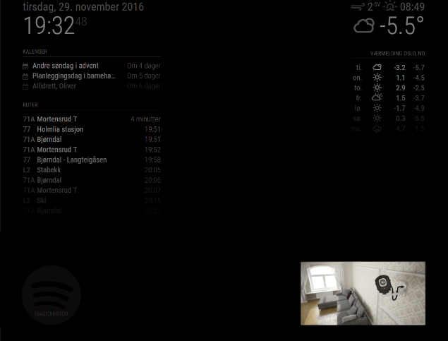

# MagicMirror² Module: MotionEye
'MMM-MotionEye' is a module for displaying a camera stream from [Motion Eye](https://github.com/ccrisan/motioneye) on your [MagicMirror²](https://magicmirror.builders/)

 

Current version is 1.6.0 See [changelog](CHANGELOG.md "Version history") for version history.

## Forum / discussion

You can discuss and get help for this module on the [Magic Mirror forum](https://forum.magicmirror.builders/topic/1085/mmm-motioneye-surveillance-video-stream-on-your-mirror).


## Pre-requisite

You have to have an installation of Motion Eye with Video Streaming enabled. Installation and usage of Motion Eye is out of scope for this documentation.

## Installation

Remote to your Raspberry Pi using SSH and clone the repository:

````bash
cd ~/MagicMirror/modules
git clone https://github.com/CatoAntonsen/MMM-MotionEye.git
````

Add the module to the modules array in the `config/config.js` file by adding the following section. Remember to change `url` to reflect **your** Motion Eye server:
```
{
	module: 'MMM-MotionEye',
	position: 'bottom_right',
	config: {
		url: "http://motioneye:8081",
		forcedRefreshInterval: 60000,
		width: 400px,
		debug: true
	}
},
```

## Configuration options

These are the valid configuration options:

### **url**
Video Streaming URL. You find it in **Motion Eye** in the **Video Streaming Section** under **Usefull URLs** by by clicking the **Streaming URL** link.
It should look something like this: `http://motioneye:8081` (probably an IP instead of hostname).

### **width**
Width of camera image. You have to try out what fits YOUR monitor.
Default is 400px.

### **id**
If you have multiple instances of this module and turned on `autoHide`, then this value has to match the **Web Hook url** in **Motion Eye**.
You can use same id on many instances if you want. 
Leave blank if you only have one camera.

### **autoHide**
This will start your camera hidden and only be visible when motion is detected. Set it to `true` to enable. Default is `false`. See `autoHideDelay` for configuring when camera will be hidden after motion detection.
This requires you to enable **Call a Web Hook** in **Motion Eye** under the **Motion Notifications section**: 

Setting | Value | Comment
---|---|---
Web Hook URL | `http://mirror:8080/motioneye` | If you have multiple instances of this module, add the module's id to the url, like this: `http://mirror:8080/motioneye/1` to show module with id '**1**'  |
Method: | **GET** | Required |

Remember to update IP white list to enable access from your Motion Eye box.

You can hide a module using similar URL's: `http://mirror:8080/motioneye/hide` or `http://mirror:8080/motioneye/hide/}{id}`

### **autoHideDelay**
If `autoHide` is enabled you can decide how long to wait before hiding the camera. Set it to `0` to never
Default is `60000` (60 seconds).

### **animationSpeed**
Sets the duration of the fade animation. Default is `2000`.

### **forcedRefreshInterval**
Forces a refresh of the video stream in case the video source temporarely is unavailable. Default is `0`. Suggested is `60000` (10 minutes).

### **allowForce**
This will allow the module to force modules to be shown (if hidden and locked by another module ex. profile-switcher). Default is `false`.

### **debug**
Show messages in the log if set to `true`. Default is `false`.

## Update

To update MMM-MotionEye, go to the MMM-MotionEye folder:
````bash
cd ~/MagicMirror/modules/MMM-MotionEye
git pull
pm2 restart mm
````


## Credits

- [surveillance  picture](http://cdn.makeuseof.com/wp-content/uploads/2015/06/creative-security-camera-intro-670x335.jpg?004f0d) stolen from [makeusof.com](http://www.makeuseof.com/)

Good luck!
